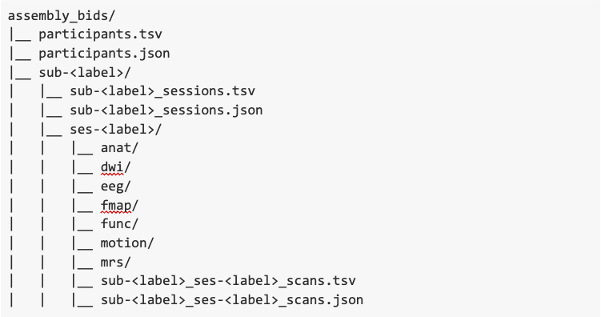

---
hide:
  - toc
---

# Brain Imaging Data Structure

As much as possible, HBCD processing tries to utilize the [Brain Imaging Data Structure](https://bids-specification.readthedocs.io/en/stable/) (BIDS) standard for data organization. At a high level, the HBCD BIDS structure will appear as follows:

As anticipated in a large infant study, many subjects will have missing data elements. As a result, the number of folders and files available for each unique subject and session will vary. Additionally, because the HBCD acquisition involves multiple modalities, some are collected at different times. Even within a single modality, certain acquisitions may be gathered on different days.

## Participants level data
Participant level data is available in the `participants.tsv` file, located at the root directory of the BIDS dataset. This file contains information about the participants’ sex. Descriptions of the TSV column names and properties of their values can be found in the sidecar `participants.json` file.

## Sessions level data
Session level data is available in the `sessions.tsv` file located in the subject folder. This file contains information about the different sessions acquired for the participant in question. This file contains information about the site of collection, the age and gestational age of the participant during the sessions, and the head size of the participant. Descriptions of the TSV column names and properties of their values can be found in the sidecar `sessions.json` file.

*Note: age measures are computed based on a birthdate measure that is jittered up to 7 days.*

## Scans level data
The complexity of data acquisition and the varying image quality across scans make the `scans.tsv` file, located in the session folder. This file contains information about how old the participant was at the time of the acquisition, and in certain cases there is also information about the quality of the underlying acquisition. To get a better understanding of what the different fields in the `scans.tsv` file mean, please refer to the `scans.json` file.

*Note: age measures are computed based on a birthdate measure that is jittered up to 7 days.*
