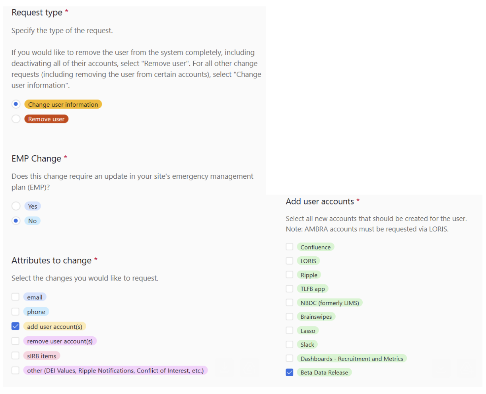

# Review Beta Data Release Site

The Beta Data Release Site is now ready for review. If you would like access to the site, please follow the below instructions.

1. Confirm that you have signed the [Data Access Policy](https://urldefense.com/v3/__https:/hbcdstudy.atlassian.net/wiki/spaces/PC/pages/447479809/Data*Access*Policy*Survey__;Kysr!!Mih3wA!CBflhwBRdkK1LbowcAAxH_XvAZEBWI14So443EvCMvsW78Ubw3uk2U746DWiCg_l41TKK7StVirKzBYHEv8BU_5x2A$).
2. Complete [this survey](https://urldefense.com/v3/__https:/hbcdstudy.atlassian.net/wiki/spaces/SH/pages/193232971/Airtable*Forms*2024__;Kys!!Mih3wA!CBflhwBRdkK1LbowcAAxH_XvAZEBWI14So443EvCMvsW78Ubw3uk2U746DWiCg_l41TKK7StVirKzBYHEv82-EsXkw$) to request access to the Beta Data Release. If you are a WG member, please list your WGs in the comment box. Only PIs and Lead RAs/CRCs can complete this survey. If you are unable to access this form, please reach out to the appropriate person at your site to submit on your behalf. 
3. Ellise Elamparo (Executive Administrator, Lasso) will schedule a training session and confirm the details.

