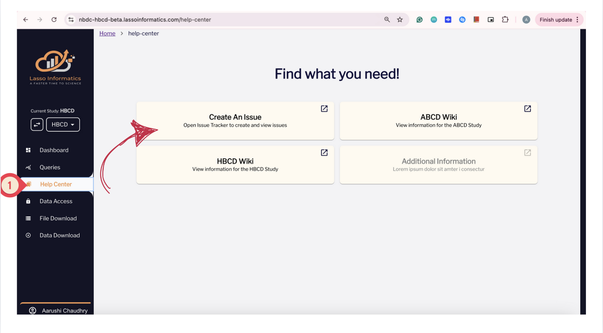
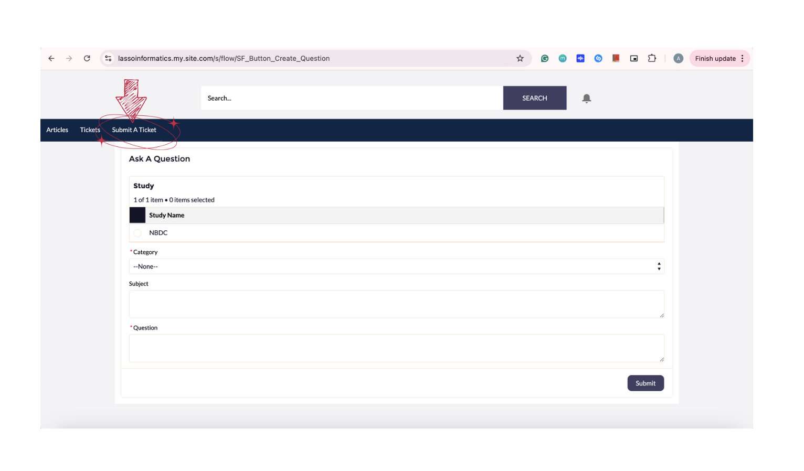

# Report Issues

If you encounter any issues or have questions regarding the Data Release documentation or data access on the Lasso Informatics platform for HBCD, please submit a help desk ticket through the following steps:

<ol>
  

  <li><strong>Log in to the Lasso Informatics platform</strong>: <a href="https://nbdc-hbcd-beta.lassoinformatics.com/">https://nbdc-hbcd-beta.lassoinformatics.com/</a></li>
  

  

  <li><strong>Access the Help Center</strong>: Select <em>Help Center</em> (left-side menu) and then click <em>Create an Issue</em>:  </li>
  

  

  <li><strong>Initiate a Ticket</strong>: Choose <em>Submit a Ticket</em> from the available options at the top of the page:  </li>
  

  

  <li><strong>Fill Out Information and Submit</strong>: Fill in all the required fields in the tracker, being sure to describe your question as clearly as possible, and click <em>Submit</em>. If you want to add an attachment or screenshot to better explain the problem, you can click on your case number following submission as demonstrated in <a href="images/reportissue.mov">this video</a>.</li>
  

</ol>

When there is a response to your ticket, you will be notified via email. You may also add more details through the link to your case provided in the email you receive.

